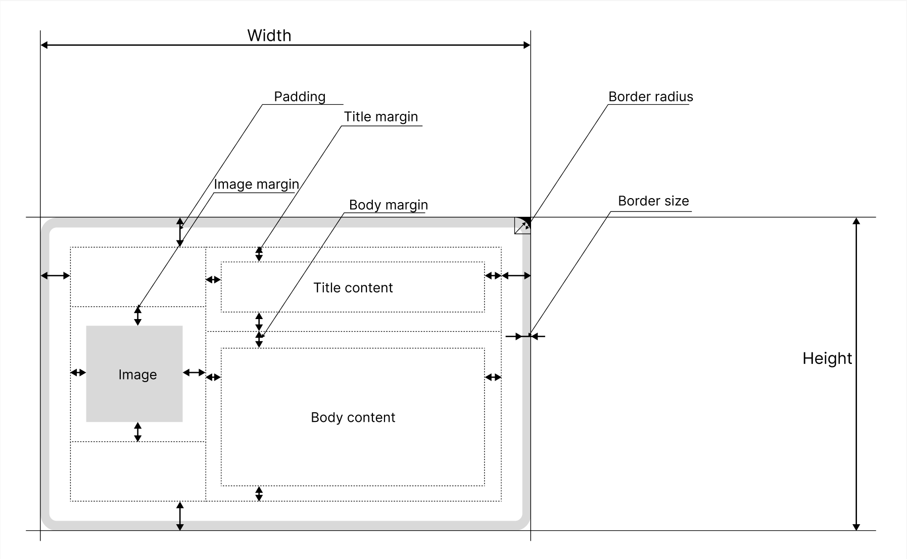

# Notification layout

- [The Layout](#the-layout)
- [Rules](#rules)
- [Style properties](#style-properties)
  - [Border](#border)
  - [Padding and margins](#padding-and-margins)

## The Layout

In general the notification is drawn by specific rules to get beautiful result. Firstly, please see the image below. It have some visual helpful information with which you will understand better about what describes. The most styles are similar to CSS styles, but they are not the same.



## Rules

Let's talk about some rules:

- If the image doesn't fits the remaining space by height, it won't draws. The empty space will be filled by other objects.
- First the Title draws and after that the body draws. So if the body text doesn't fits the remaining space, it omits.
- Also if the title is very big that doesn't fits because the you picked too font size, it also omits.

Knowing the rules above, you will understand that need be neat at particular cases. The developers are not responsible for incorrect drawing if it breaks the rules above.

## Style properties

Since here introduces the term 'notification banner' or 'banner' if simpler. It mean the rectangle of notification in which places the helpful content like tile, body and image.

### Border

To notification banner you can apply border styles: border size, radius and color.

- Border size - the width of stroke which is outlines around the banne. It draws in the rectangle, so the inner elements can overlay the border if you pick margin smaller than border size.
- Border radius - the radius which will applied for rounding the corners of banner.
- Border color - the color of stroke.

> [!NOTE]
> You can find that the behavior of banner rounding is different from other applications. Here the simple rules for it: inner radius gets from formula $radius - size$. It means that inner rounding won't draws if border size exceeds the radius.

For information about correct values of border properties follow to the [list of config properties](./ConfigProperties.md).

### Padding and margins

Within scope of this application, the padding and margin have different meaning. The padding is the offset from the banner edges for inner elements, it's like giving the content area smaller.
The margin is the offset from the edges of remaining area and other inner elements. If you have some difficult to understand these terms, please go to the [image](#the-layout) above to see what here means.

> [!NOTE]
> If you have issue that the image or the text doesn't show in banner, it's maybe because of large value of padding or margins that the content can't fit into remaining space.

Here are two ways to declare properties for the padding and the margins:

- [CSS-like](#css-like)
- [Explicit](#explicit)

#### CSS-like

If you familiar with CSS, you know that the padding or the margin can be applied in single row:

```css
body {
    padding: 0 5; /* Applies vertical and horizontal paddings respectively */
    margin: 3 2 5; /* Applies top, horizontal and bottom paddings respectively */
}

main {
    padding: 1 2 3 4; /* Applies top, right, bottom, left paddings respectively */
    margin: 3; /* All-directional margin */
}
```

In the TOML config file you can do it using array:

```toml
# Applies vertical and horizontal paddings respectively
padding = [0, 5] 

# Applies top, horizontal and bottom paddings respectively
margin = [3, 2, 5]

# Applies top, right, bottom, left paddings respectively
padding = [1, 2, 3, 4] 

# All-directional margin
margin = 3
```

#### Explicit

If you don't like the CSS-like properties, here an explicit way. You can use table instead the array and write directions as keys: top, bottom, right and left.
Also if you wanna apply the same value for top and bottom (right and left) together, here the vertical (horizontal) values.

```toml
# Sets only top padding
padding = { top = 3 }

# Sets only top and right padding
padding = { top = 5, right = 6 }

# Insead of
# padding = { top = 5, right = 6, bottom = 5 }
# Write
padding = { vertical = 5, right = 6 }

# If gots collision of values the error will throws because of ambuguity
# padding = { top = 5, vertical = 6 }

# You can apply the same way for margin
margin = { top = 5, horizontal = 10 }

# For all-directional padding or margin, set only nubmer as above in CSS
padding = 10
margin = 5
```
